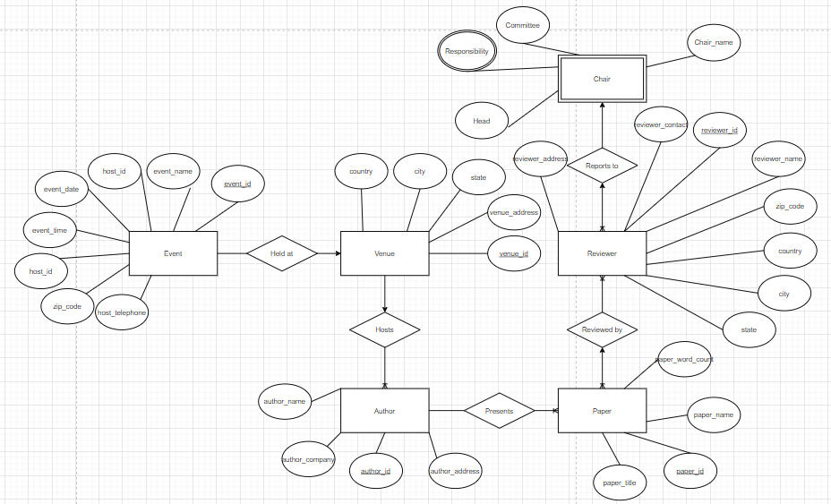

# SQL_DB_FILL
## Motivation
Final Project for Database Systems
### Description: 
"Design a database for storing information about a conference organization, including event, venue, chairs, reviewers, authors, papers (using sqlite3)"

### Thought Process
Partially pseudo-random insertion of placeholder values using C program and SQLite statements. SQL statements in SQLite command prompt used to copy data from original database "db" to db1 and db2, where db1 represents the first decomposition of the original database, and db2 represents the second decomposition of the original database. Each database uses foreign keys to create relationships between tables. 

db1 uses some different ID tables to split off information from the original tables, where the main tables end up with foreign keys that reference these newly created tables that contain various attendee IDs.

db2 uses a zip code table that contains location information(city, state, country) to add another layer of foreign keys that associates the zip codes with attendees, address, etc.

### Entity-Relation Diagram created in draw.io

#### Link to final project document
https://docs.google.com/document/d/1mQar-l0PMBd7Zdv9YIMMmnW-mBUc1GOgB36Pa3xKFwM/edit?usp=sharing
